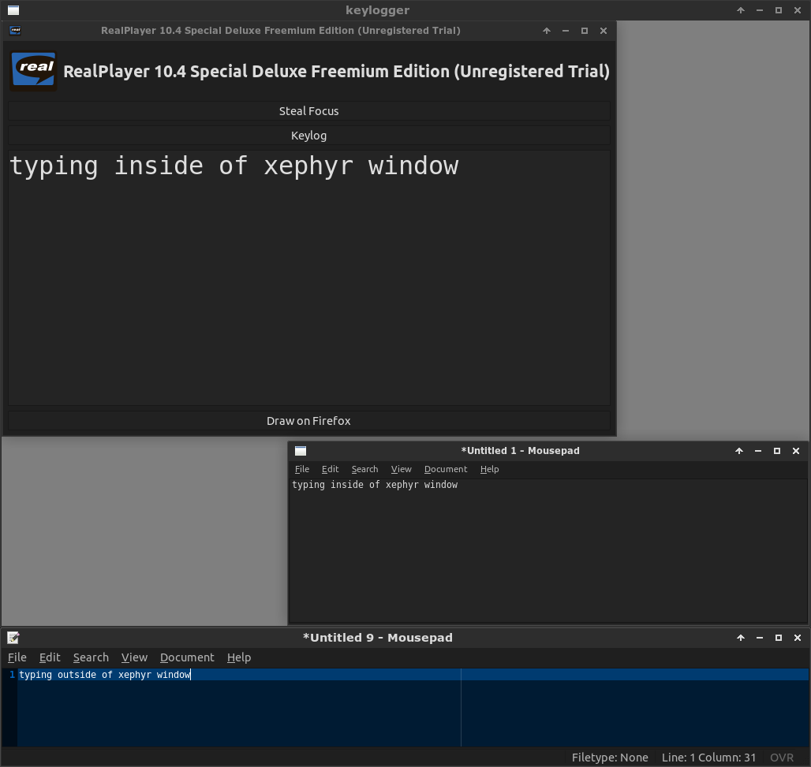

### archlinux install

```bash
pacman -S xsel xorg-server-xephyr docker util-linux xorg-xauth
systemctl start docker.service
```

### ubuntu install

```bash
sudo apt-key adv --keyserver hkp://p80.pool.sks-keyservers.net:80 --recv-keys 58118E89F3A912897C070ADBF76221572C52609D
sudo sh -c 'echo "deb https://apt.dockerproject.org/repo ubuntu-`lsb_release -c -s` main" > /etc/apt/sources.list.d/docker.list'
sudo apt-get update
sudo apt-get install xsel xserver-xephyr docker-engine linux-image-extra-virtual
sudo service docker start
```

### setup pulseaudio

```bash
sudo sh -c 'echo "load-module module-native-protocol-tcp" >> /etc/pulse/default.pa'
pulseaudio -k
pulseaudio --start
```

### init

```bash
python2 dockercask.py build base
python2 dockercask.py add firefox
python2 dockercask.py add spotify
python2 dockercask.py build firefox
python2 dockercask.py build spotify
```

### run app

```bash
python2 dockercask.py run firefox
```

### run multiple instances

```bash
python2 dockercask.py add firefox#1
python2 dockercask.py run firefox#1
python2 dockercask.py add firefox#2
python2 dockercask.py run firefox#2
python2 dockercask.py add firefox#3
python2 dockercask.py run firefox#3
```

### keylogger test

This will demonstrate an example X11 keylogger
[github.com/magcius/keylog](https://github.com/magcius/keylog) that will only
function within the xephyr window. Preventing logging of keyboard and mouse
events outside of the xephyr window. Keylogger will only run inside of
the docker container and will not have any effect on the host system. Click
"Keylog" after starting to activate.



```bash
python2 dockercask.py add keylogger
python2 dockercask.py build keylogger
python2 dockercask.py run keylogger
```
