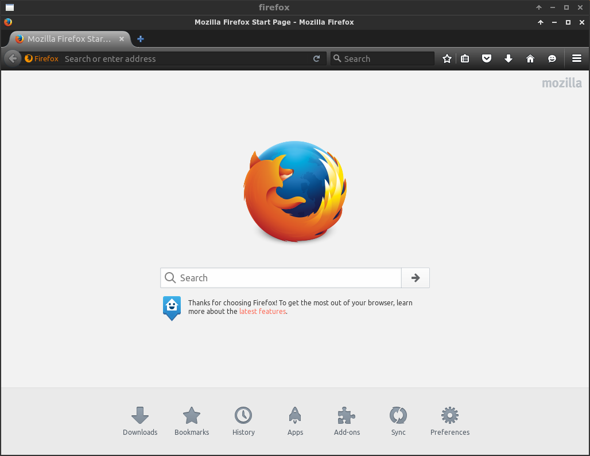

# dockercask

Simple python script to run desktop applications securely inside docker
containers. Images are built using the
[pritunl/archlinux](https://hub.docker.com/r/pritunl/archlinux/) base image.
All containers are run without `--privileged` mode inside seperate
[Xephyr](https://en.wikipedia.org/wiki/Xephyr) windows that are secured with a
[X11 Cookie](https://en.wikipedia.org/wiki/X_Window_authorization). The
clipboard is shared using `xsel` and PulseAudio is aviaible in the docker
containers.

### archlinux install

```bash
pacman -S xsel wmctrl xorg-server-xephyr docker util-linux xorg-xauth
systemctl start docker.service
```

### ubuntu install

```bash
sudo apt-key adv --keyserver hkp://p80.pool.sks-keyservers.net:80 --recv-keys 58118E89F3A912897C070ADBF76221572C52609D
sudo sh -c 'echo "deb https://apt.dockerproject.org/repo ubuntu-`lsb_release -c -s` main" > /etc/apt/sources.list.d/docker.list'
sudo apt-get update
sudo apt-get install xsel wmctrl xserver-xephyr docker-engine linux-image-extra-virtual
sudo service docker start
```

### docker v1.10.0

Docker v1.10.0 is required which is still in testing. Use the commands below
to install the v1.10.0 release candidate.

##### archlinux

```bash
git clone https://github.com/dockercask/docker-dev.git
cd docker-dev
makepkg
pacman -U docker-*.pkg.tar.xz
systemctl restart docker.service

```

##### ubuntu

```bash
curl -fsSL https://test.docker.com/ | sh
sudo service docker restart
```

### setup pulseaudio

PulseAudio will not work when shared memory is used. The commands below will
disable shared memory and then restart the PulseAudio server.

```bash
sudo sh -c 'echo "enable-shm = no" >> /etc/pulse/daemon.conf'
pulseaudio -k
pulseaudio --start
```

### add and application

Adding an application will first pull the ArchLinux docker image then build the
images needed for the application. After the images have been built the
directory `~/Docker/firefox` will be created which will be mounted to the
docker container to store the application data. A desktop entry will also be
added to `~/.local/share/applications/docker-firefox.desktop` this will allow
launching the application for the start menu.

```bash
python2 dockercask.py add firefox
python2 dockercask.py run firefox
```

### run firefox

An application can be started using the desktop entry or by running the command
below.

```bash
python2 dockercask.py run firefox
```



### run multiple instances

Only one instance of an application can be run. To use multiple instances
suffix the application name with a number.

```bash
python2 dockercask.py add firefox#1
python2 dockercask.py add firefox#2
python2 dockercask.py add firefox#3
python2 dockercask.py run firefox#2
python2 dockercask.py run firefox#1
python2 dockercask.py run firefox#3
```

### remove and application

Removing an application will delete the data directory in `~/Docker` and the
desktop entry.

```bash
python2 dockercask.py remove firefox
```

### xauthority

The security of the host X11 screen is dependent on preventing the docker
containers from accessing the xauthority file which is generally stored at
`~/.Xauthority`. If you mount the home directory or otherwise provide access
to this file the docker container could be able to access the host X11 screen.

### clipboard sharing

When starting an app dockercask will watch the clipboads of the host and
Xephyr X11 screen using `xsel`. When one of the clipboards change the other
clipboard will be updated. This update will also persist to any other running
Xephyr windows.

### chrome

Chrome and Chromium do not run in a Docker container without `--no-sandbox` to
disable Chromium's sandbox. This will show a warning when starting. The Docker
container with Xephyr already providies sufficient sandboxing and overall the
host system should be more secure.

### shared memory

Docker releases before v1.10.0 have a hard coded `/dev/shm` size of 64m. This
is too small for Chromium's IPC and also Firefox's Electrolysis which uses the
same IPC code from Chromium. With this size the browser will frequently crash
when the `/dev/shm` is full. Other apps will also have rendering issues without
increasing the `/dev/shm` size.

### lastpass

Password managers such as LastPass should not be run in the same container as
the web browser. If the web browser is compromised the password manager could
also be compromised. This can be avoided by running a separate browser for a
password manager or using the LastPass desktop app.

### slack

For slack to close properly you will need to uncheck "Leave app running in
notification area when the window is closed". Hardware acceleration should
also be disabled.

### keylogger test

This will demonstrate an example X11 keylogger
[github.com/magcius/keylog](https://github.com/magcius/keylog) that will only
function within the Xephyr window. Preventing logging of keyboard and mouse
events outside of the Xephyr window. The keylogger will only run inside of
the docker container and will not have any effect on the host system. Click
"Keylog" after starting to activate.

```bash
python2 dockercask.py add keylogger
python2 dockercask.py build keylogger
python2 dockercask.py run keylogger
```


