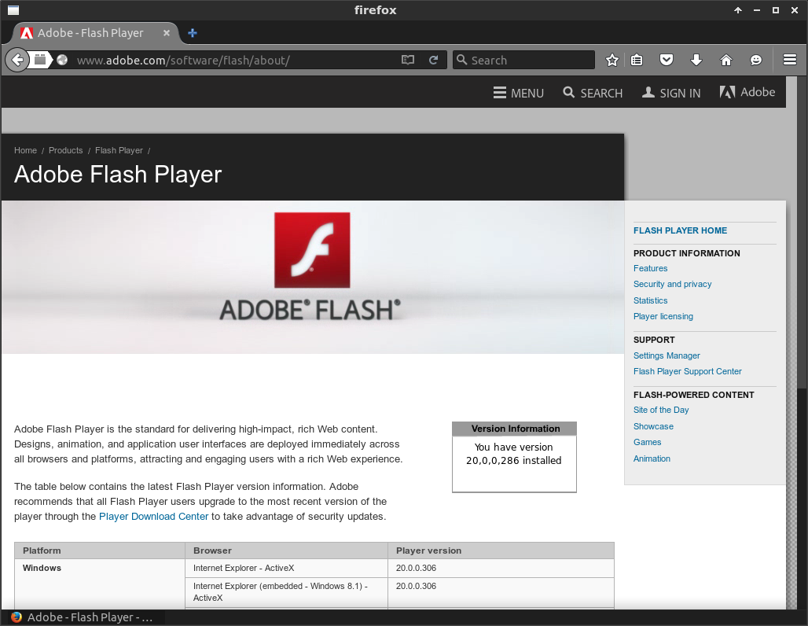

# dockercask

Simple python script to run desktop applications securely inside docker
containers. Images are built using the
[pritunl/archlinux](https://hub.docker.com/r/pritunl/archlinux/) base image.
All containers are run without `--privileged` mode inside seperate
[Xephyr](https://en.wikipedia.org/wiki/Xephyr) windows that are secured with a
[X11 Cookie](https://en.wikipedia.org/wiki/X_Window_authorization). The
clipboard is shared using `xsel` and PulseAudio is aviaible in the docker
containers.

### archlinux install

```bash
pacman -S xsel xorg-server-xephyr docker util-linux xorg-xauth
systemctl start docker.service
```

### ubuntu install

```bash
sudo apt-key adv --keyserver hkp://p80.pool.sks-keyservers.net:80 --recv-keys 58118E89F3A912897C070ADBF76221572C52609D
sudo sh -c 'echo "deb https://apt.dockerproject.org/repo ubuntu-`lsb_release -c -s` main" > /etc/apt/sources.list.d/docker.list'
sudo apt-get update
sudo apt-get install xsel xserver-xephyr docker-engine linux-image-extra-virtual
sudo service docker start
```

### setup pulseaudio

```bash
sudo sh -c 'echo "load-module module-native-protocol-tcp" >> /etc/pulse/default.pa'
pulseaudio -k
pulseaudio --start
```

### init

```bash
python2 dockercask.py add firefox
python2 dockercask.py add spotify
python2 dockercask.py add thunderbird
python2 dockercask.py build-all
```

### run firefox

```bash
python2 dockercask.py run firefox
```



### run multiple instances

```bash
python2 dockercask.py add firefox#1
python2 dockercask.py run firefox#1
python2 dockercask.py add firefox#2
python2 dockercask.py run firefox#2
python2 dockercask.py add firefox#3
python2 dockercask.py run firefox#3
```

### xauthority

The security of the host X11 screen is dependent on preventing the docker
containers from accessing the xauthority file which is generally stored at
`~/.Xauthority`. If you mount the home directory or otherwise provide access
to this file the docker container could be able to access the host X11 screen.

### clipboard sharing

When starting an app dockercask will watch the clipboads of the host and
xephyr X11 screen using `xsel`. When one of the clipboards change the other
clipboard will be updated. This update will also persist to any other running
xephyr windows.

### chrome

Chrome and Chromium do not run without `--no-sandbox` to disable Chrome's
sandbox. There is also an issue with unix domain sockets that breaks Chrome's
IPC. This is fixed by using `--ipc=host` which will give the docker container
access to the hosts IPC. This same issue is also present in Firefox's
multi process system that is in beta now which uses the IPC code from Chromium.
Using `--ipc=host` to disable the containers IPC namespace will make the host
more vulnerable. The current version of Firefox can be run with an IPC
namespace.

### lastpass

Password managers such as LastPass should not be run in the same container as
the web browser. If the web browser is compromised the password manager could
also be compromised. This can be avoided by running a separate browser for a
password manager or using the LastPass desktop app.

### slack

For slack to close properly you will need to uncheck "Leave app running in
notification area when the window is closed". Hardware acceleration should
also be disabled.

### keylogger test

This will demonstrate an example X11 keylogger
[github.com/magcius/keylog](https://github.com/magcius/keylog) that will only
function within the xephyr window. Preventing logging of keyboard and mouse
events outside of the xephyr window. The keylogger will only run inside of
the docker container and will not have any effect on the host system. Click
"Keylog" after starting to activate.

```bash
python2 dockercask.py add keylogger
python2 dockercask.py build keylogger
python2 dockercask.py run keylogger
```


